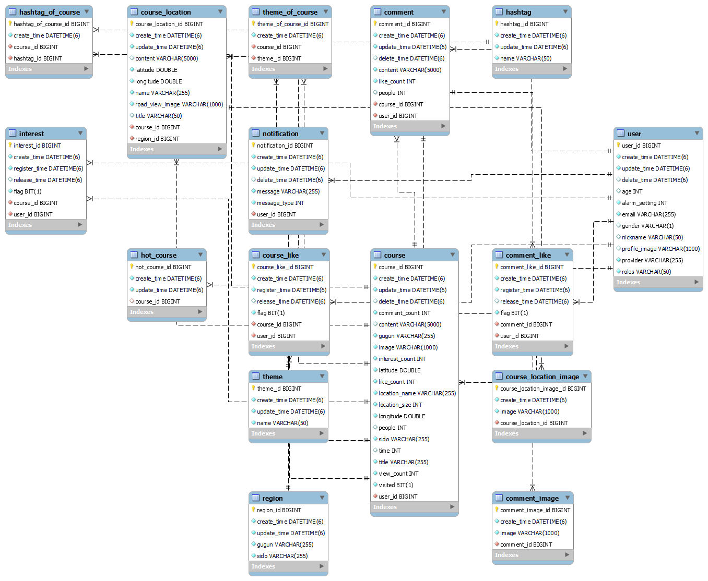

<div align="center">
  
</div>

<div align="center">
	<div>
    <h1> 🗺 코스모스 ( 코스 맞춤 추천 플랫폼 ) 🚩 </h1>
	  
	</div>
</div>
<br />

## 목차

### 1. [**서비스 개요**](#서비스-개요)

### 2. [**기술 스택**](#기술-스택)

### 3. [**주요 기능**](#주요-기능)

### 4. [**프로젝트 구성도**](#프로젝트-구성도)

### 5. [**UCC 영상**](#ucc-영상)

### 6. [**프로젝트 기간**](#프로젝트-기간)

### 7. [**팀원 소개**](#팀원-소개)

<br />

<div id="1"></div>

# 📖서비스 개요

**자신의 코스를 만들고, 다른 사람과 함께 공유하세요!**
<<<<<<< HEAD

> - 사용자의 위치 기반 주변 코스 보기
> - 지난 한 주 간의 인기 코스 보기
> - 다양한 검색 필터로 원하는 코스 검색 가능
> - 좋아요, 관심, 댓글 작성 등으로 공감
> - 구글 지도를 활용한 장소 검색
> - 로드뷰 자동 가져오기 및 이미지 첨부 가능
=======
>
> - 서비스 개요 작성
>>>>>>> 067680d (📝 docs : README 1차 작성)

<br />

- [코스모스 웹 서비스 바로가기 Click! 👈](https://coursemores.site/)
- [코스모스 Notion 바로가기 Click! 👈](https://coursemores.notion.site/Moham-737a75b7ac1241a1b469b8ab5effd7c6)

<br />

# 🛠 기술 스택

## FrontEnd

<<<<<<< HEAD
| <div align="center"> |
| :-----------------------------------------------------------------------------------------------------: |
|                                                 Flutter                                                 |
=======
| <div align="center"> | 
| :-: | 
| Flutter |  
>>>>>>> 067680d (📝 docs : README 1차 작성)

<br />

## BackEnd

| <div align="center"> </div> | <div align="center"></div> | <div align="center"> </div> | <div align="center"></div> |
<<<<<<< HEAD
| :-----------------------------------------------------------------------------------------------------: | :--------------------------------------------------------------------------------------------------------: | :-----------------------------------------------------------------------------------------------------------------: | :----------------------------------------------------------------------------------------------------------------------: |
|                                                  Java                                                   |                                 &nbsp;&nbsp;&nbsp;Gradle&nbsp;&nbsp;&nbsp;                                 |                                                     Spring-Boot                                                     |                                                &nbsp;SpringDataJPA&nbsp;                                                 |

| <div align="center"> </div> | <div align="center"></div> |
| :-------------------------------------------------------------------------------------------------------: | :------------------------------------------------------------------------------------------------------: |
|                                                   MySQL                                                   |                                                  Redis                                                   |
=======
| :-----------------------------------------------------------------------------------------------------: | :--------------------------------------------------------------------------------------------------------: | :-----------------------------------------------------------------------------------------------------------------: | :-------------------------------------------------------------------------------------------------------------------------: | 
|                                                  Java                                                   |                                 &nbsp;&nbsp;&nbsp;Gradle&nbsp;&nbsp;&nbsp;                                 |                                                     Spring-Boot                                                     |                                                &nbsp;SpringDataJPA&nbsp;                                                 |

| <div align="center"> </div> | <div align="center"></div> |
| :-------------------------------------------------------------------------------------------------------: | :-----------------------------------------------------------------------------------------------------------: |
|                                                   MySQL                                                   |                                                    Redis                                                   |

<<<<<<< HEAD
| <div align="center"> </div> | <div align="center"></div> | <div align="center"></div> |
| :-------------------------------------------------------------------------------------------------------: | :-----------------------------------------------------------------------------------------------------------: |:-----------------------------------------------------------------------------------------------------------: |
|                                                   Elasticsearch                                                   |                                                    Logstash                                                  |                                                   Kibana                                                |
>>>>>>> 067680d (📝 docs : README 1차 작성)

=======
>>>>>>> 59652e5 (📝 docs : README 2차 작성)
<br />

## DevOps

<<<<<<< HEAD
| <div align="center"> </div> | <div align="center"></div> | <div align="center"></div> | <div align="center"></div> | <div align="center"></div> |
<<<<<<< HEAD
| :---------------------------------------------------------------------------------------------------------: | :----------------------------------------------------------------------------------------------------------: | :------------------------------------------------------------------------------------------------------: | :---------------------------------------------------------------------------------------------------------: | :-------------------------------------------------------------------------------------------------------: |
|                                                   Docker                                                    |                                             &nbsp;Jenkins&nbsp;                                              |                                      &nbsp;&nbsp;NginX&nbsp;&nbsp;                                       |                                             &nbsp;AWS EC2&nbsp;                                             |                                            &nbsp;AWS S3&nbsp;                                             |

| <div align="center"> </div> | <div align="center"></div> | <div align="center"></div> | <div align="center"></div> |
| :-----------------------------------------------------------------------------------------------------------------------: | :------------------------------------------------------------------------------------------------------------: | :--------------------------------------------------------------------------------------------------------: | :-----------------------------------------------------------------------------------------------------------------: |
|                                                       Elasticsearch                                                       |                                             &nbsp; Logstash &nbsp;                                             |                                            &nbsp;Kibana &nbsp;                                             |                                              &nbsp; Elastic APM &nbsp;                                              |

| <div align="center"></div> |
| :---------------------------------------------------------------------------------------------------------------: |
|                                               &nbsp;SonarQube&nbsp;                                               |
=======
| :---------------------------------------------------------------------------------------------------------: | :----------------------------------------------------------------------------------------------------------: | :------------------------------------------------------------------------------------------------------: | :--------------------------------------------------------------------------------------------------: | :------------------------------------------------------------------------------------------------: |
|                                                   Docker                                                    |                                             &nbsp;Jenkins&nbsp;                                              |                                      &nbsp;&nbsp;NginX&nbsp;&nbsp;                                       |                                         &nbsp;AWS EC2&nbsp;                                          |                                         &nbsp;AWS S3&nbsp;                                         |

<br />
>>>>>>> 067680d (📝 docs : README 1차 작성)
=======
| <div align="center"> </div> | <div align="center"></div> | <div align="center"></div> | <div align="center"></div> |<div align="center"></div> |
| :---------------------------------------------------------------------------------------------------------: | :----------------------------------------------------------------------------------------------------------: | :------------------------------------------------------------------------------------------------------: | :--------------------------------------------------------------------------------------------------: | :------------------------------------------------------------------------------------------------: |
|                                                   Docker                                                    |                                             &nbsp;Jenkins&nbsp;                                              |                                      &nbsp;&nbsp;NginX&nbsp;&nbsp;                                       |                                         &nbsp;AWS EC2&nbsp;                                          |                                         &nbsp;AWS S3&nbsp;                                         |

| <div align="center"> </div> | <div align="center"></div> | <div align="center"></div> |<div align="center"></div> |
| :-------------------------------------------------------------------------------------------------------: | :-----------------------------------------------------------------------------------------------------------: |:-----------------------------------------------------------------------------------------------------------: |:-----------------------------------------------------------------------------------------------------------: |
|                                                   Elasticsearch                                                   |                                &nbsp;                    Logstash                 &nbsp;                                 |                                                   &nbsp;Kibana                         &nbsp;                       |                                                  &nbsp; Elastic APM  &nbsp;                 |

| <div align="center"></div> |
|:-:|
|                                        &nbsp;SonarQube&nbsp;                                         |
>>>>>>> 59652e5 (📝 docs : README 2차 작성)

<br />

<div id="3"></div>

# 💡 주요 기능

<<<<<<< HEAD
- **다양한 코스 검색**

  ```
  사용자 위치 기반 주변 코스, 금주 인기 코스, 다양한 검색 필터로 원하는 코스 검색 가능
  ```

- **사용자 기반 코스 작성**

  ```
  구글 지도를 활용한 장소 검색으로 편리한 코스 작성
  로드뷰 자동 가져오기 및 이미지 첨부 가능
=======
- **기능제목**

  ```
  기능설명
>>>>>>> 067680d (📝 docs : README 1차 작성)
  ```

<br />

<div id="4"></div>

# 📂프로젝트 구성도

- **시스템 아키텍처**

  

<br />

- **ERD**

<<<<<<< HEAD
<<<<<<< HEAD
  
=======
  
=======
  
>>>>>>> 59652e5 (📝 docs : README 2차 작성)
  
<br />

- **추천 Sequence Diagram**

  
>>>>>>> 067680d (📝 docs : README 1차 작성)

<br />

# 🎥UCC 영상

<<<<<<< HEAD
[](https://www.youtube.com/watch?v=lZh7i7-TZ8g)
=======
[](https://youtu.be/youtube)
>>>>>>> 067680d (📝 docs : README 1차 작성)

> 새 창 열기 방법 : Ctrl + click (on Windows and Linux) | CMD + click (on MacOS)

<br />

# 📅 프로젝트 기간

**2023.04.10(월) ~ 2023.05.19(금)**

<br />

# 👪팀원 소개

<!--
 -->

<<<<<<< HEAD
<<<<<<< HEAD
=======
>>>>>>> 59652e5 (📝 docs : README 2차 작성)
> - 이상민(팀장 / BE) : 프로젝트 총괄, API 개발
> - 우상빈(팀원 / BE) : 데이터셋 수집, API 개발
> - 윤지영(팀원 / FE) : 화면 구성, 디자인
> - 이지원(팀원 / BE) : 인프라 구축 및 CI/CD, API 개발
> - 임성준(팀원 / FE) : 화면 구성, QA
> - 전태영(팀원 / FE) : 화면 구성
<<<<<<< HEAD
=======
> - 이상민(팀장 / BE) : 
> - 우상빈(팀원 / BE) : 
> - 윤지영(팀원 / FE) : 
> - 이지원(팀원 / BE) : 
> - 임성준(팀원 / FE) : 
> - 전태영(팀원 / FE) : 
>>>>>>> 067680d (📝 docs : README 1차 작성)
=======
>>>>>>> 59652e5 (📝 docs : README 2차 작성)

<br />
