

	

    <h1> 📷 시연 시나리오 💻 </h1>
	

 

## < 시연 순서 >

### 1. [**User**](#user)

### 2. [**Main**](#main)

### 3. [**코스 검색**](#search)

### 4. [**코스 작성**](#post)

### 5. [**코스 조회**](#info)

### 6. [**코스 댓글**](#comment)

### 7. [**마이페이지**](#mypage)

 

> # User
<<<<<<< HEAD
<<<<<<< HEAD

 
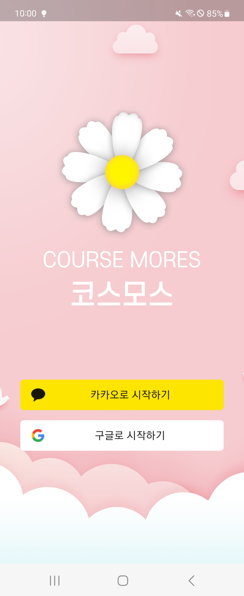
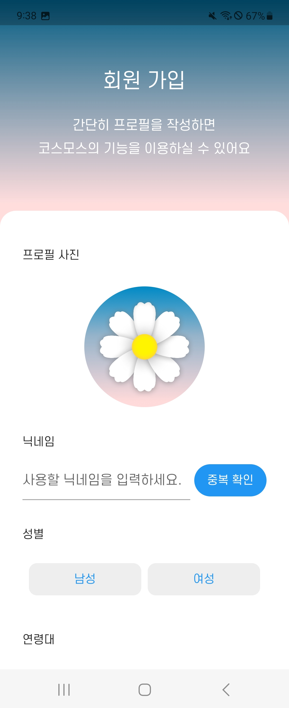

=======

 

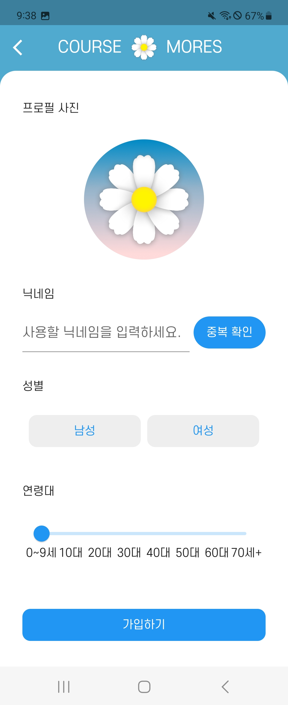
>>>>>>> 35155c0 (📝 docs : 산출물 정리)
  
 coursemores 접속 시 카카오와 구글 로그인이 가능합니다.
 
 프로필 사진, 닉네임, 성별, 연령대를 입력하여 회원가입을 합니다.
 
이때 닉네임은 중복 확인을 하여 서로 겹치는 닉네임이 없도록 검사합니다.
 
 
<<<<<<< HEAD
=======
>
>  
> 
> 
> 
>   
>  coursemores 접속 시 카카오와 구글 로그인이 가능합니다.
>  
> 프로필 사진, 닉네임, 성별, 연령대를 입력하여 회원가입을 합니다.
>  
> 이때 닉네임은 중복 확인을 하여 서로 겹치는 닉네임이 없도록 검사합니다.
>   
>   
>>>>>>> 276d468 (✨ feat : 시연시나리오 수정)
=======
>>>>>>> 35155c0 (📝 docs : 산출물 정리)

> # Main

  
<<<<<<< HEAD
 
 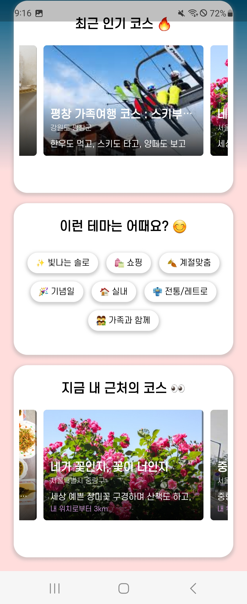
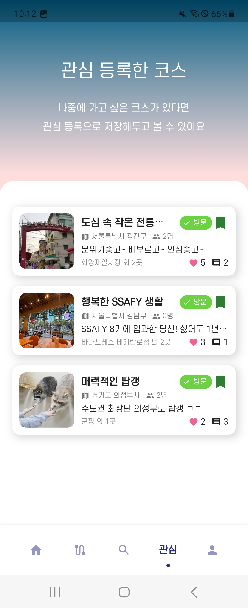
=======
 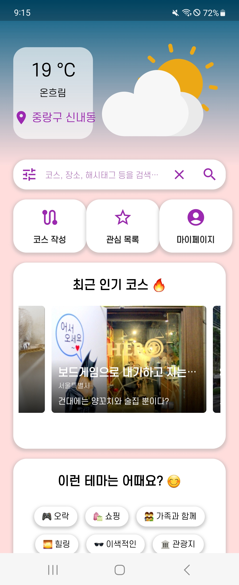
 

>>>>>>> 276d468 (✨ feat : 시연시나리오 수정)
 
메인화면에서 검색, 코스작성, 관심목록, 마이페이지를 바로 갈 수 있으며
 
 현재 위치에 따른 날씨 정보와 최근 인기 코스, 테마리스트, 내 근처의 코스 등 다양한 기능들이 있습니다.
  
  

> # Search

<<<<<<< HEAD
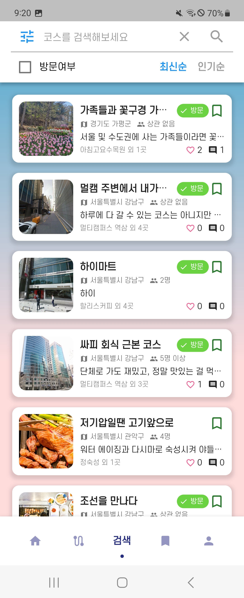

=======

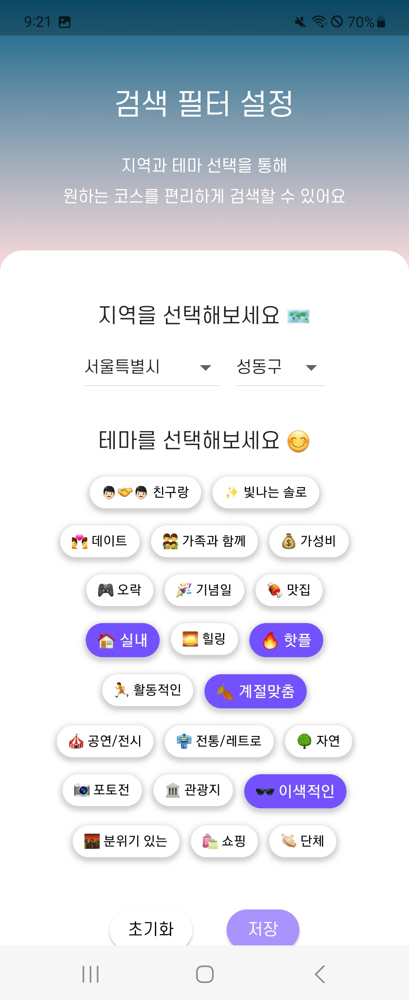
>>>>>>> 276d468 (✨ feat : 시연시나리오 수정)
 
검색탭에 들어가서 다양한 코스들을 검색할 수 있습니다.
 
검색창에 단어를 입력하면 어플에 저장된 다양한 코스들의 제목, 장소들, 해시태그들이 자동완성되는 검색엔진을 제공하고있습니다. 
 또한 검색 필터를 제공하여 지역과 테마를 기반으로 코스 검색이 가능합니다.
 
 

> # Post

 
<<<<<<< HEAD
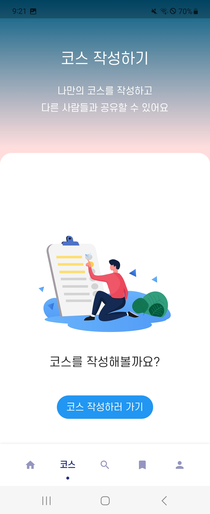

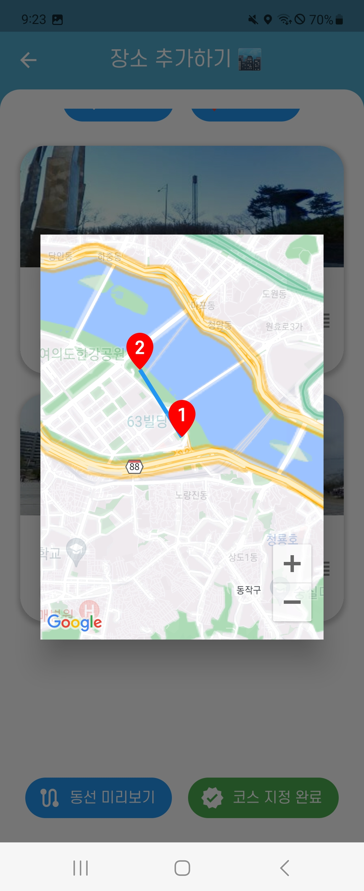
=======

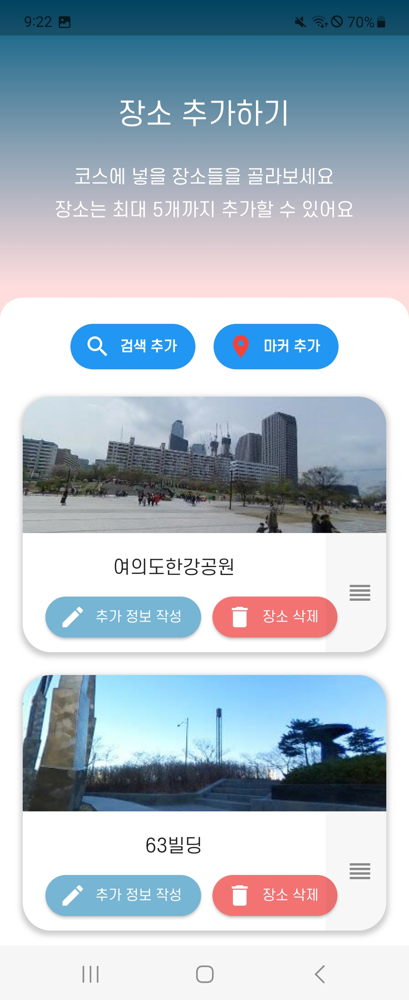
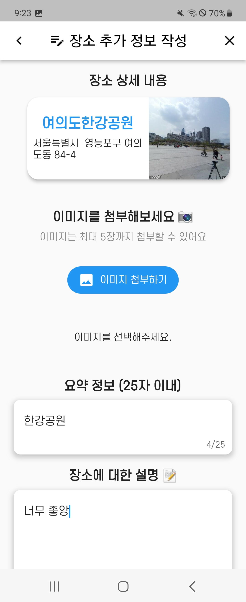

>>>>>>> 276d468 (✨ feat : 시연시나리오 수정)
 
코스 작성탭에 가서 나만의 코스를 작성할 수 있습니다.
 
장소를 검색하여 추가하거나 마커를 통해 지도에서 직접 장소를 선택할 수 있습니다.
 
추가한 장소의 상세정보를 작성할 수 있으며 작성된 코스들의 동선을 지도를 통해 볼 수 있습니다.
 
 
<<<<<<< HEAD

=======
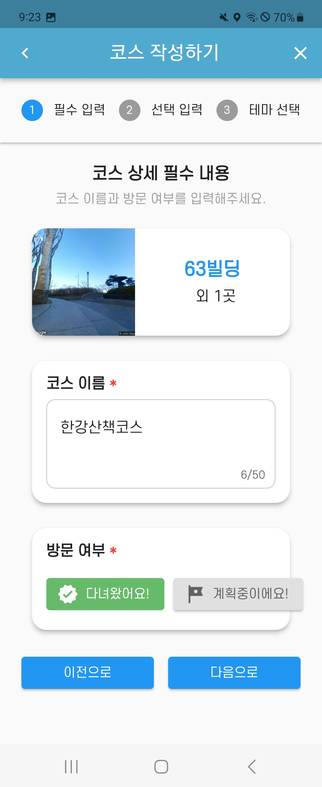
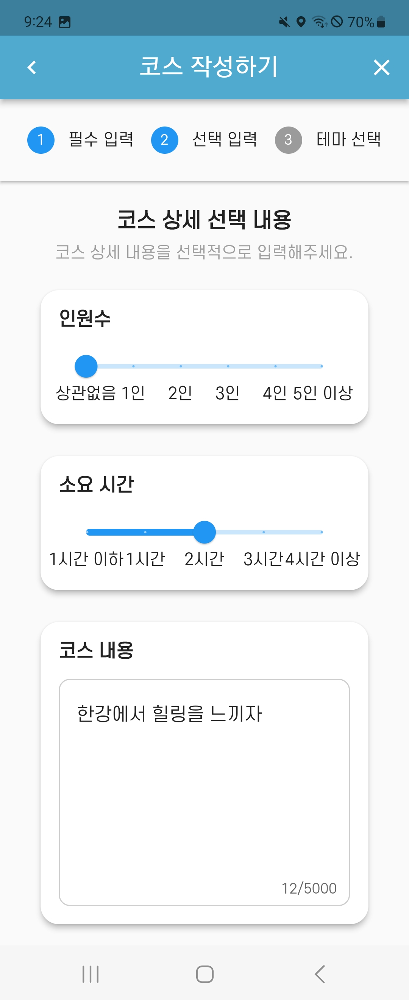
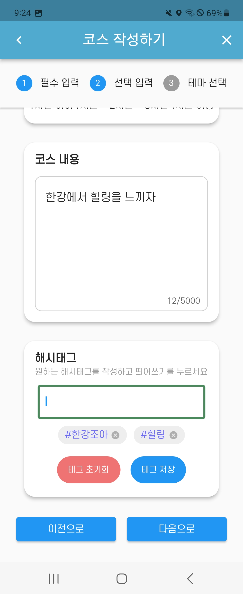
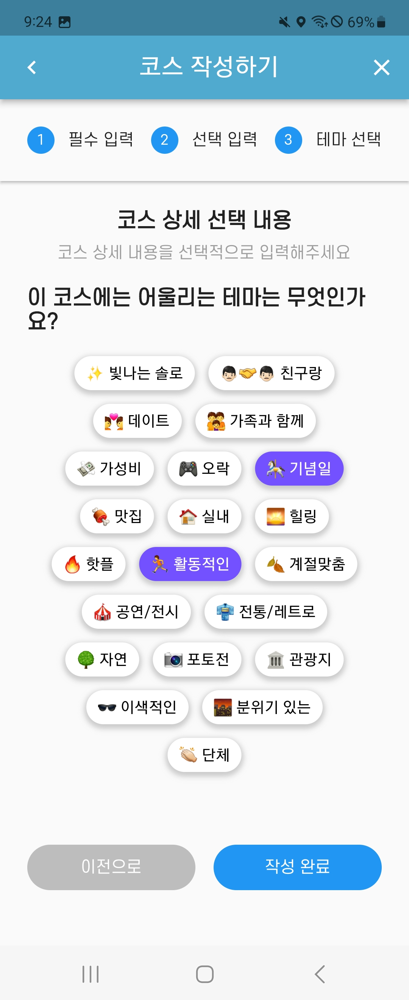
>>>>>>> 276d468 (✨ feat : 시연시나리오 수정)
 
코스 상세 내용을 작성하고 해시태그와 테마를 선택할 수 있습니다.
 
 

> # Info

 
<<<<<<< HEAD
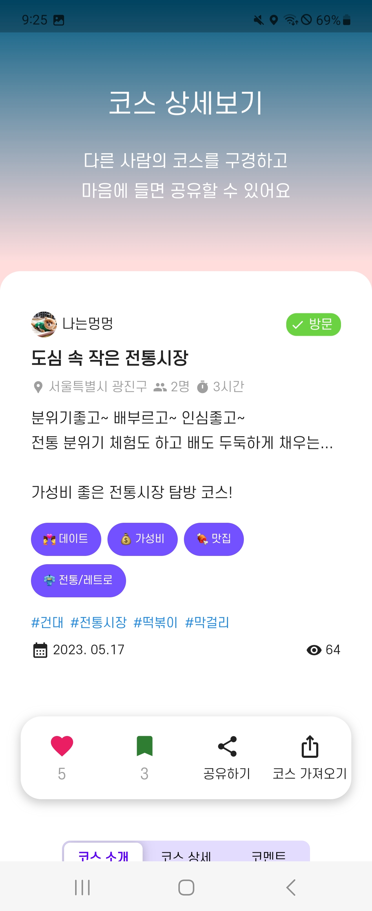

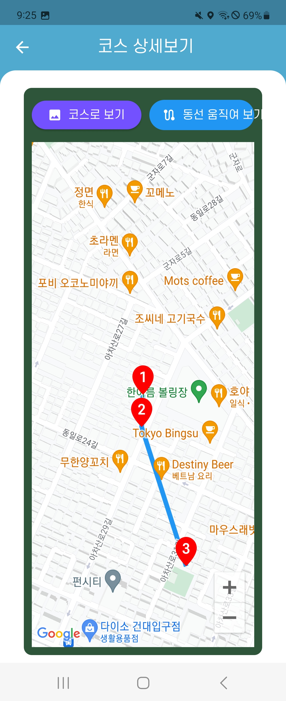

=======

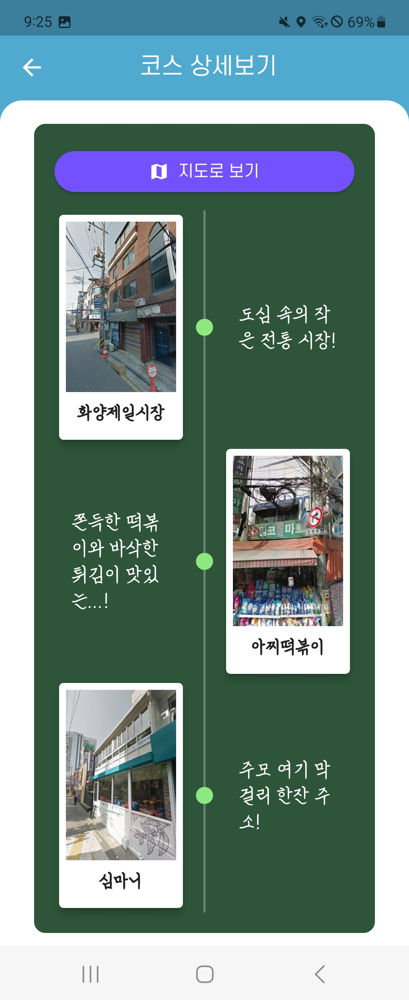

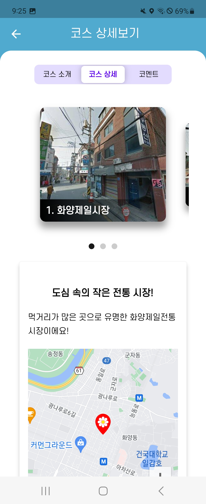
>>>>>>> 276d468 (✨ feat : 시연시나리오 수정)
 
코스 상세에서 좋아요, 관심 등록, 공유하기, 코스 가져오기 등을 할 수 있습니다.
 
코스들을 한눈에 볼 수 있으며 사진과 지도 2가지로 볼 수 있으며 상세페이지에서 자세한 정보들을 볼 수 있습니다.
 
 

## 코스 가져오기

<<<<<<< HEAD
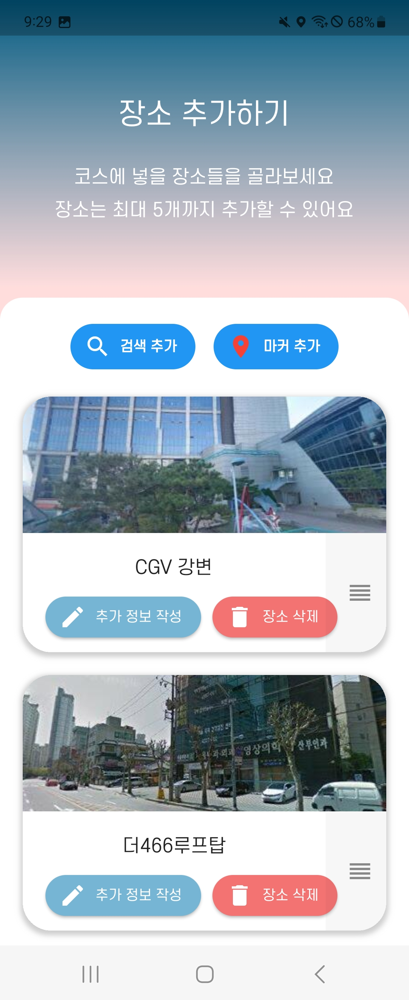
=======

>>>>>>> 276d468 (✨ feat : 시연시나리오 수정)
 
코스 가져오기 클릭 시 코스의 정보들을 가지고 직접 수정하여 올릴 수 있습니다.

 

> # Comment

<<<<<<< HEAD

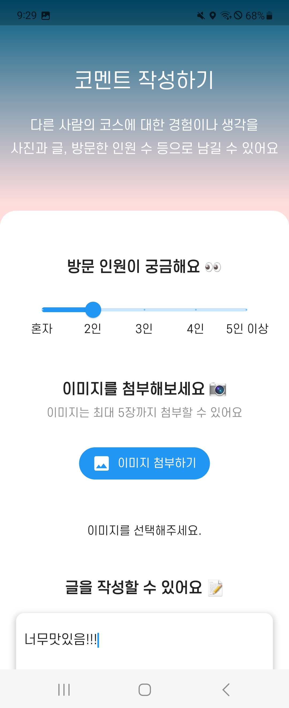
=======

>>>>>>> 276d468 (✨ feat : 시연시나리오 수정)
 
코스 상세에 들어가 댓글을 작성할 수 있으며 다른 댓글에 좋아요를 누를 수 있습니다.
 
 

> # Mypage

<<<<<<< HEAD
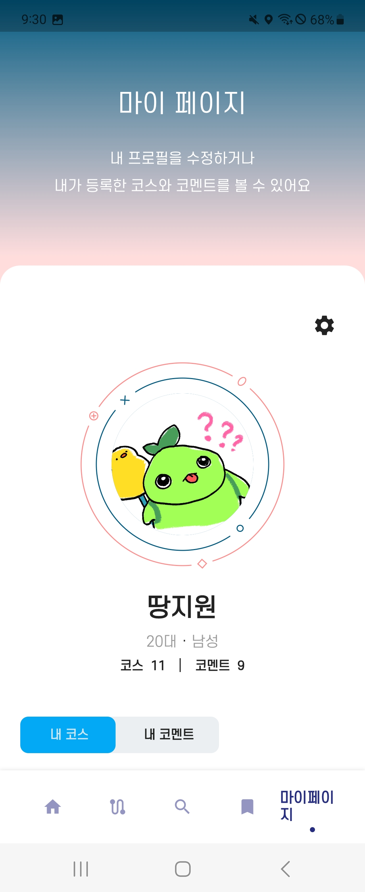

=======

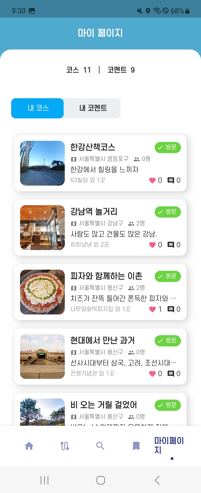
>>>>>>> 276d468 (✨ feat : 시연시나리오 수정)
 
마이페이지에선 내가 작성한 코스 게시물과 댓글을 볼 수 있습니다.
 
